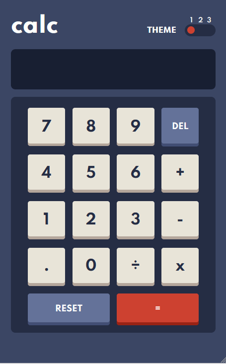
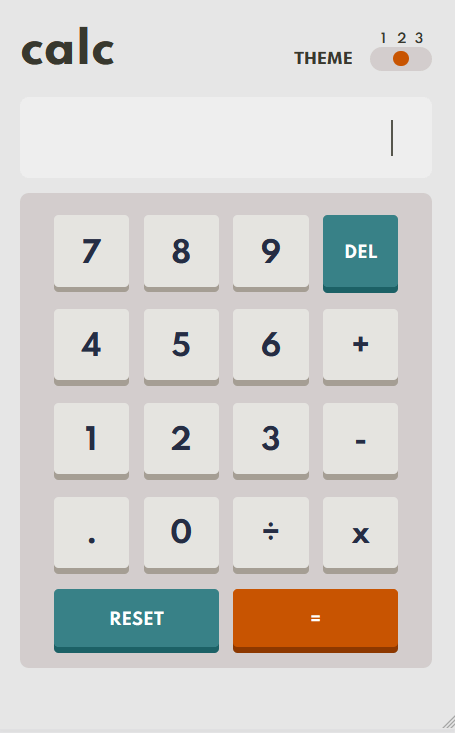
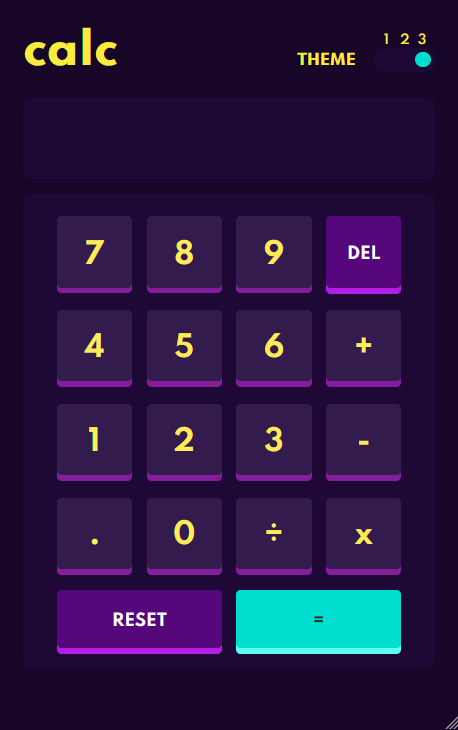

# Calculator

This is a project of Frontend Mentor

https://www.frontendmentor.io/challenges/calculator-app-9lteq5N29

This was my first step with javascript, my first page with localstorage and handle diferents themes.

## Page deployed with Netlify

https://calcuwithjs.netlify.app/

